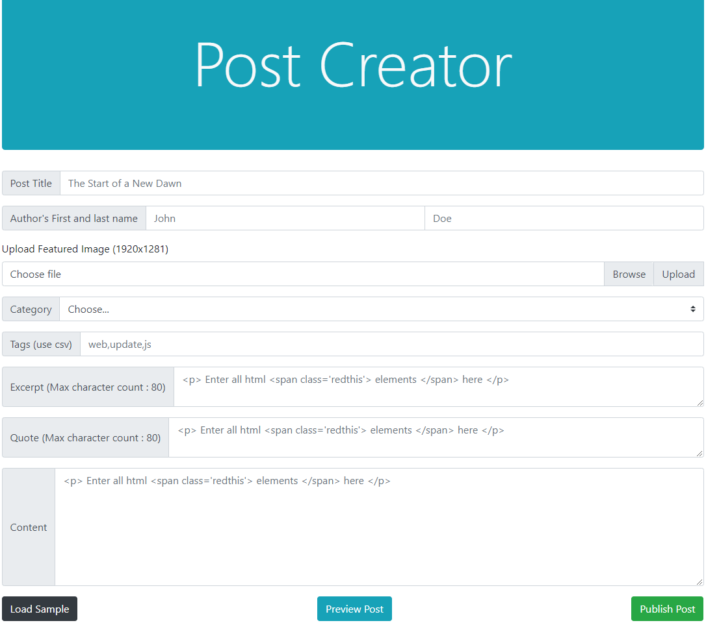

# simple-blogpost-creator
### Simple blog post creator with upload function

Post creator was made for my blog to start publishing posts while I create a full CMS, It is easily customizable; if you know a bit of php and sql, you can easily tailor this to your own needs. 

Intended as a quick place holder hack solution for a single blog, so no authorization restraints or secure features implemented, well except the SQL(PDO prepared statements).

##### Features
* Quick file upload to a folder
* Preview button to see how it on the web
* Publish button to sql server database

Load Template button, not implemented (planned on loading the fields with sample data)

preview.php can be changed with your blogs custom styling, just remember to plug-in the dynamic fields.

